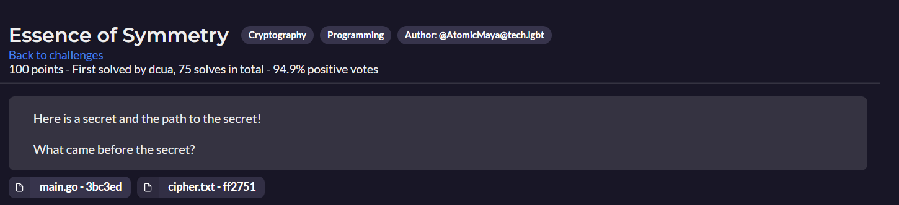

# **DigitalOverdose CTF**
## **Essence of Symmetry - Crypto** - 100 points 

Challenge cung cấp 2 files là main.go và cipher.txt. Các bạn có thể tải tệp tin [tại đây](https://github.com/LaoDaiDia/CTF/tree/main/2022/digitaloverdosectf).

### 1. Đầu tiên ta phân tích tập tin main.go
#### 1.1 Hàm op(word string, key int) dùng để XOR từng ký tự của chuỗi word truyền vào với key, kết quả thu được lưu vào chuỗi out.
